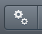
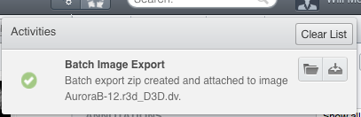

Download and export images
==========================

We will show how the possibilities of getting images from OMERO. These can be described as “export” (new image, usually a jpeg, tiff or png is
created from the original image saved in OMERO) or “download” (the original image, in the original format is downloaded from OMERO).

Description:
------------

Image export and download can be achieved using any of the three main clients for OMERO (OMERO.insight, OMERO.web or command line interface). Further, we have developed an “omero-downloader”, a command-line application dedicated specifically to the downloading and exporting of images and annotations from OMERO.

We will show:

-  How to export images from OMERO.web

-  How to download images from OMERO.web

-  How to use “Batch image export” script for batch exports of images

-  How to use OMERO.downloader for downloads and exports

-  How to use OMERO.downloader for export of metadata associated with the images

-  How to navigate through the structure created by OMERO.downloader

Setup:
------

-  omero-downloader was installed by downloading and unzipping of the release artifact \ `https://github.com/ome/omero-downloader/releases/download/latest/ <https://github.com/ome/omero-downloader/releases/download/v0.1.5/OMERO.downloader-0.1.5-release.zip>`__

-  omero-downloader works on Mac, Windows and Linux

**Resources:**
--------------

The documentation on OMERO.downloader can be found at  https://github.com/ome/omero-downloader/blob/master/README.md

Downloader commands used in this walkthrough are in https://raw.githubusercontent.com/ome/training-scripts/master/practical/bash/downloader-commands

Step-by-Step:
-------------

1. In OMERO.web, select one or more images you want to download. Then, find in the top of the right-hand pane the download icon |image1|, click on it and select the desired action, for example Download, which downloads the data in original format.

2. Open the downloaded file(s) in the software of your choice.

3. To export images in a different format such as PNG, TIFF or OME-TIFF, we can use a script on the server to build a zip for download. Select images, click on the script icon |image2| and click on “export scripts” and then choose “\ Batch Image Export…\ ”. You can choose to export individual channels and/or the “merged” image (current rendering settings). It is also possible to export multiple Z and T sections. The image Format can also be specified. If OME-TIFF is chosen, the Channels and Z/T sections are ignored and the entire image is exported as an OME-TIFF image.

4. Click Run Script to generate the zip on the server. When the script completes, the Activities panel will display the result. Click the Download button to download the zip.\ |image3|

5. Open one image in iviewer and draw several ROIs. Back in webclient, add several Tags onto the same image. Using the download icon in the right-hand pane, |image1| export the image as OME-TIFF.

6. Reimport the OME-TIFF again into OMERO and verify the imported image still has the ROIs and Tags, same as the original image prior to export. Note: This workflow can be used to transfer the image with its metadata into another OMERO.server if available.

Image export using omero-downloader (demo only)
-----------------------------------------------

1. Open a CLI terminal on your machine and go into the directory where omero-downloader is installed.

2. To download a single image, run the following command. It assumes that the target directory already exists e.g. /tmp/repo

   a. On Mac or Linux

      i.  Note: Copy the following command from \ https://raw.githubusercontent.com/ome/training-scripts/master/practical/bash/downloader-commands

      ii. $ ./download.sh -b /tmp/repo -s <server host> -u <user name> -w <password> -f binary Image:<image ID>

   b. On Windows

      iii. Note: Copy the following command from \ https://raw.githubusercontent.com/ome/training-scripts/master/practical/bash/downloader-commands

      iv.  $ download.bat -b /tmp/repo -s <server host> -u <user name> -w <password> -f binary Image:<image ID>

3. To download all images in a Dataset, run

   c. Note: Copy the following command from \ https://raw.githubusercontent.com/ome/training-scripts/master/practical/bash/downloader-commands\ into your Terminal.

   d. $ ./download.sh -b /tmp/repo -s <server host> -u <user name> -w <password> -f binary Dataset:<Dataset ID>

   e. Note that you will be able to deduce what tags and annotations the downloaded images were annotated with.

   f. Go to OMERO.web and Tag several images from two datasets with a tag “your-name”. Then, go back to the command line and run

      v.   Note: Copy the following command from \ https://raw.githubusercontent.com/ome/training-scripts/master/practical/bash/downloader-commands\ into your Terminal.

      vi.  $ ./download.sh -b /tmp/repo -s <your server address> -u <user name> -w <password> -f ome-xml Dataset:$ID2,$ID1

      vii. This will download the xml metadata for images in those two datasets (Note: we could download all the images as well, but we can do it at any later point, as downloader “remembers” what is downloaded already and does not re-download it twice.)

   g. Note: Copy the grep command from \ https://raw.githubusercontent.com/ome/training-scripts/master/practical/bash/downloader-commands\ into your Terminal.

   h. This will find the IDs of all the images from the two datasets tagged with “your-name” tag.

